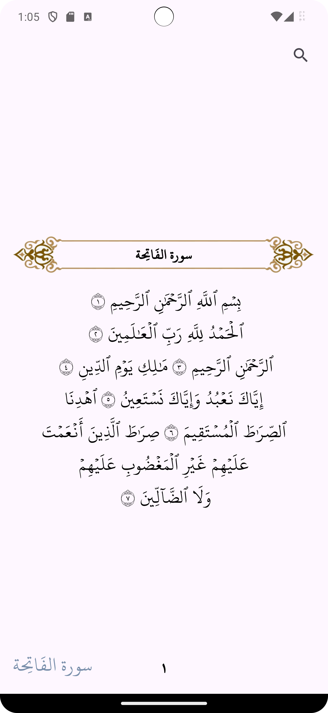
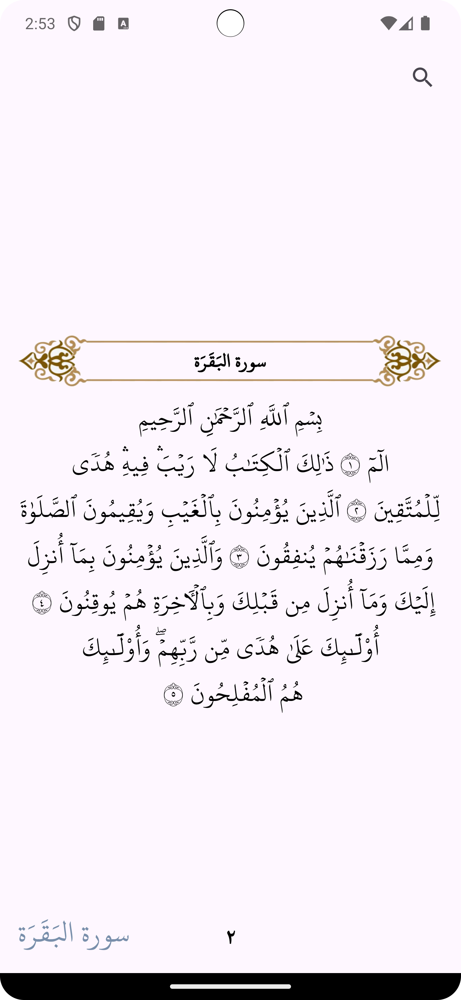
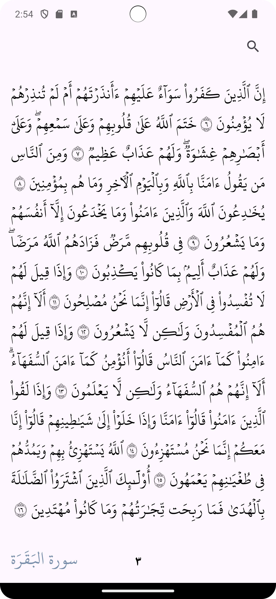
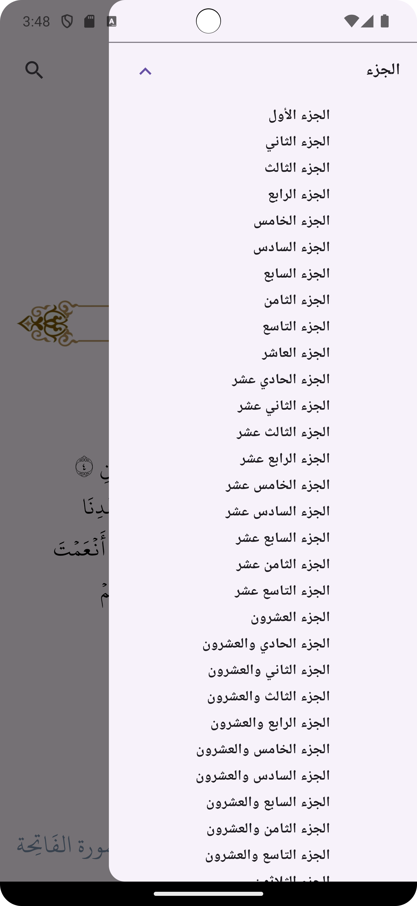
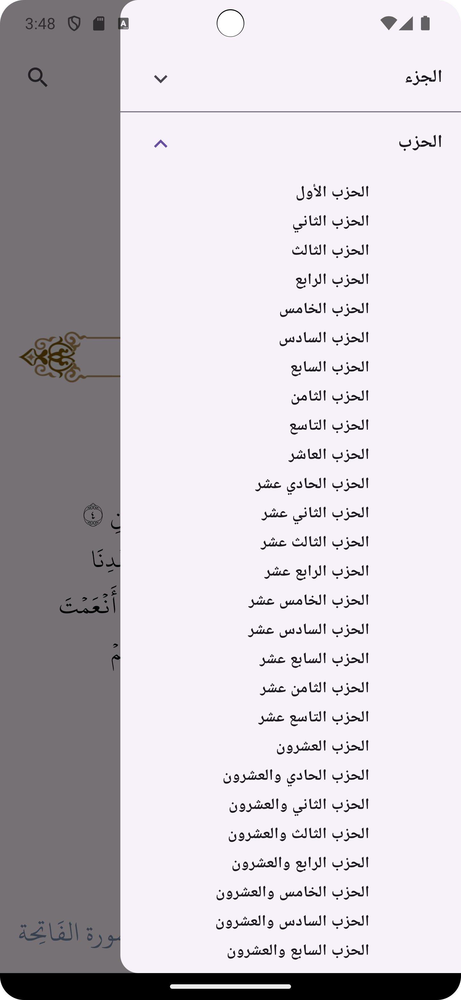
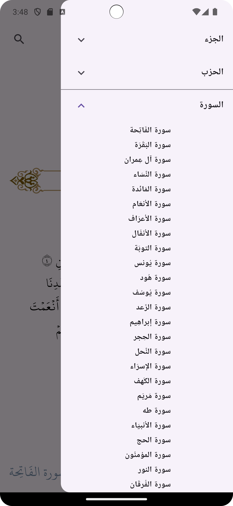
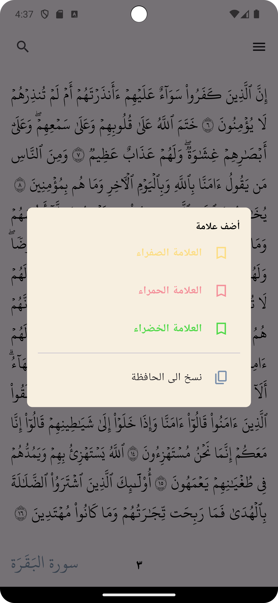
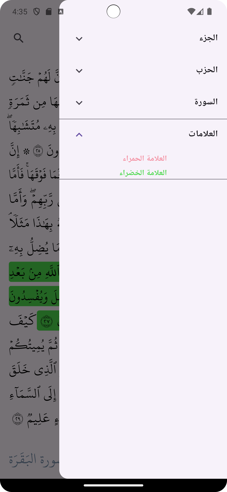
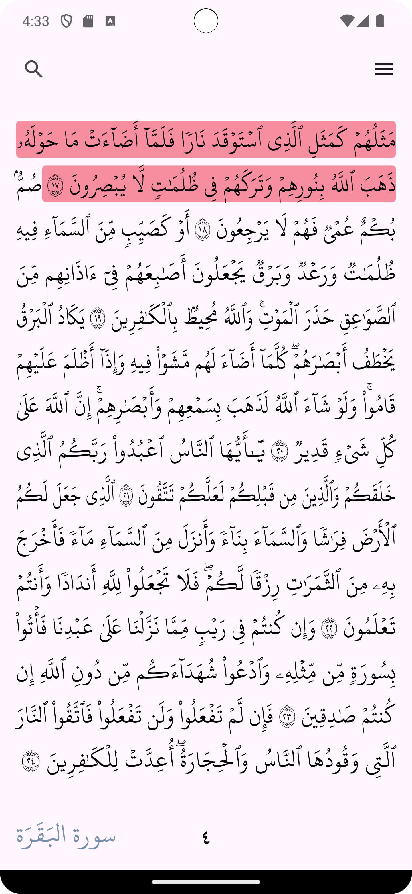
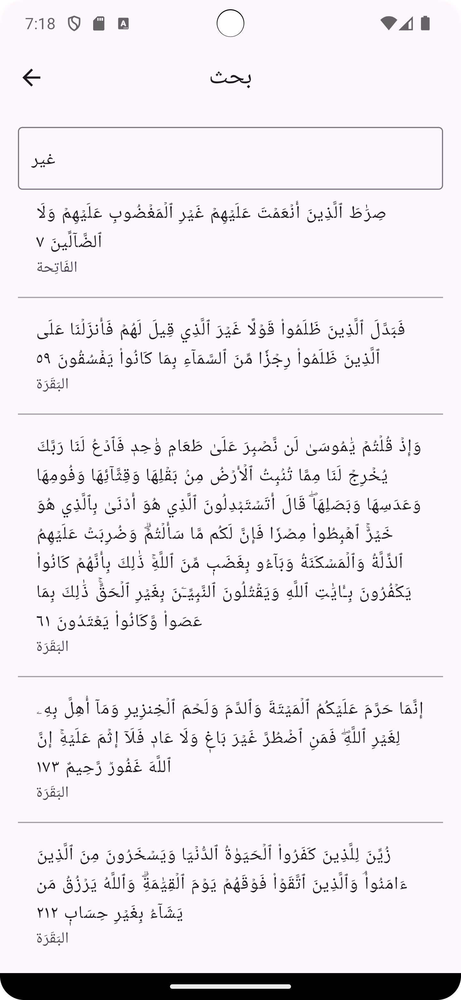

<!--
This README describes the package. If you publish this package to pub.dev,
this README's contents appear on the landing page for your package.

For information about how to write a good package README, see the guide for
[writing package pages](https://dart.dev/guides/libraries/writing-package-pages).

For general information about developing packages, see the Dart guide for
[creating packages](https://dart.dev/guides/libraries/create-library-packages)
and the Flutter guide for
[developing packages and plugins](https://flutter.dev/developing-packages).
-->

<div align="center">  
 <h1 align="center" style="font-size: 70px;">Flutter Quran</h1>

<!--  Donations -->
 <a href="https://buymeacoffee.com/heshamerfau">
  
 </a>
<!--  Donations -->

<h3 align="center" style="font-size: 35px;">Need anything Flutter related? Reach out on <a href="https://www.linkedin.com/in/hesham-erfan-876b83105/">LinkedIn</a>
</h3>


</div>

# flutter_quran 
### This Package allows you integrate Quran offline in your app and it will work without the need for any other resources.
#### Note that the json used in the package to provide all quran details is from [مجمع الملك فهد لطباعة المصحف الشريف](https://qurancomplex.gov.sa/)


# Features

* ###  View all Quran Pages like Madina's Quran.
* ###  Save user's last opened page.
* ###  Search for any text in Quran.
* ###  Navigate to any page in Quran.
* ###  Get a list of all Jozzs and navigate to any Jozz.
* ###  Get a list of all hizbs and navigate to any hizb.
* ###  Get a list of all Surahs and navigate to any Surah.
* ### Adding, removing and navigating to bookmarks .


## Getting started

In the `pubspec.yaml` of your flutter project, add the following dependency:

```yaml
dependencies:
  ...
  flutter_quran: ^0.0.1
```

Import it:

```dart
import 'package:flutter_quran/flutter_quran.dart';
```

Initialize it:

```dart
FlutterQuran().init();
```

## Usage Example

### Basic Quran Screen

```dart
/// You can just add it to your code:
Scaffold(body: FlutterQuranScreen());
/// or give it some options:
FlutterQuranScreen(
  appBar: AppBar(
    actions: [
      Padding(
        padding: const EdgeInsetsDirectional.only(end: 22.0),
        child: GestureDetector(
          onTap: () => Navigator.of(context).push(MaterialPageRoute(builder: (ctx) => SearchScreen())),
            child: Icon(Icons.search)),
      ),
    ],
  ),
onPageChanged: (int pageIndex) => print("Page changed: $pageIndex"),
),
```

* ### You can find more in the examples

  


### The package provides a lot of utils like


```dart
/// Getting all Quran's Jozzs, Hizbs, and Surahs
final jozzs = FlutterQuran().getAllJozzs();
final hizbs = FlutterQuran().getAllHizbs();
final surahs = FlutterQuran().getAllSurahs();
```

  

```dart
/// Adding, setting, removing, getting and navigating to bookmarks
// In init function
FlutterQuran().init(userBookmarks: [Bookmark(id: 0, colorCode: Colors.red.value, name: "Red Bookmark")]);
final usedBookmarks = FlutterQuran().getUsedBookmarks();
FlutterQuran().setBookmark(ayahId: 24, page: 4, bookmarkId: 0);
FlutterQuran().removeBookmark(bookmarkId: 0);
FlutterQuran().navigateToBookmark(bookmark);
```

  


```dart
/// searching for a word
TextField(
  onChanged: (txt) {
    final _ayahs = FlutterQuran().search(txt);
      setState(() {
        ayahs = [..._ayahs];
      });
  },
  decoration: InputDecoration(
    border:  OutlineInputBorder(borderSide: BorderSide(color: Colors.black),),
    hintText: 'بحث',
  ),
),
```



```dart
/// Navigating through Quran
FlutterQuran().navigateToAyah(ayah);
FlutterQuran().navigateToPage(1);
FlutterQuran().navigateToJozz(1);
FlutterQuran().navigateToHizb(1);
FlutterQuran().navigateToSurah(1);
FlutterQuran().navigateToBookmark(bookmark);
```

```dart
/// You can use Quran's style if you needed it
FlutterQuran().hafsStyle;
```


### You can find more features in the [Github repo](https://github.com/heshamerfan97/flutter_quran)
